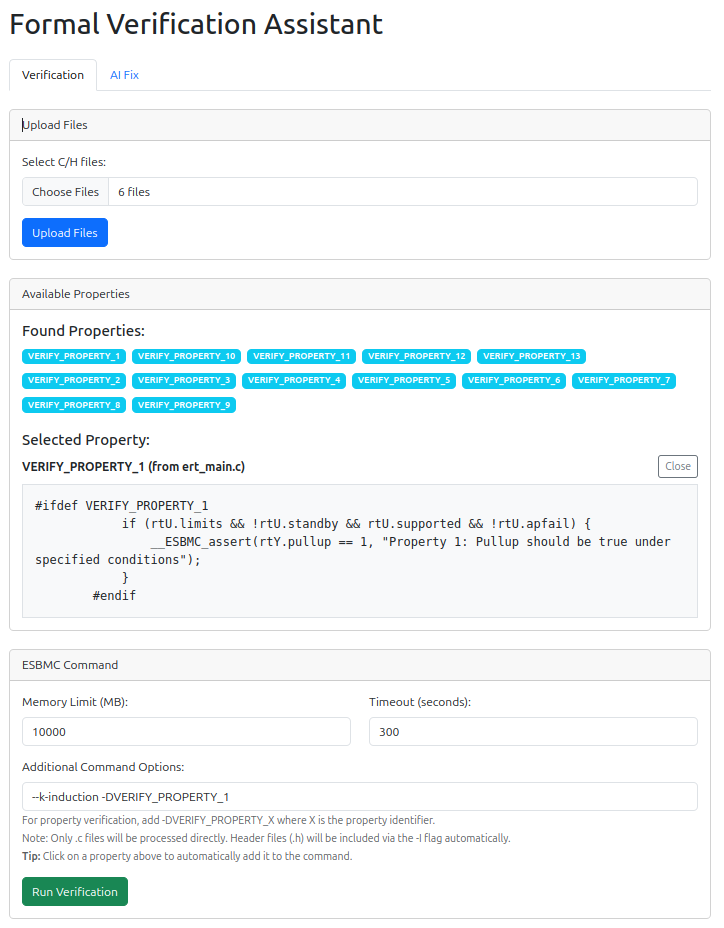
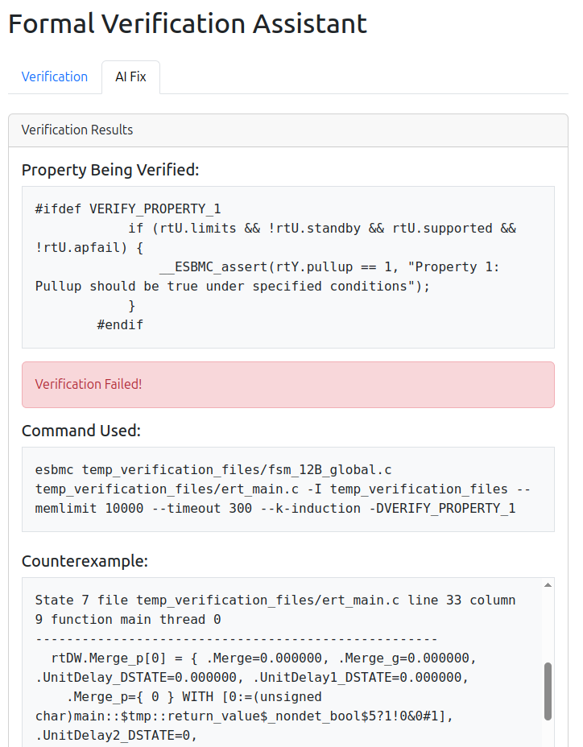
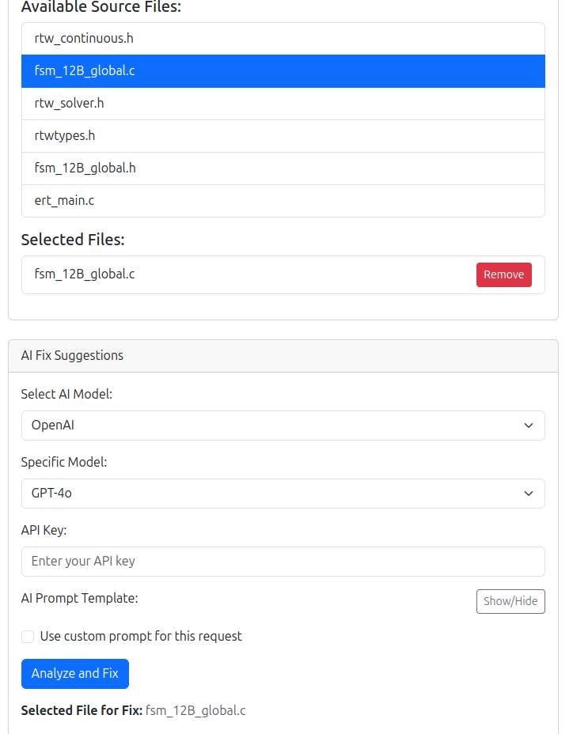

Here is used to record what I have done and how the UI looks like.

Currently, the AI fixing part is not working well. first the result is not catched as my expected. I can get the result print but failed to show it in the frontend.

Besides that, the repair is quite bad. It tried to fix the bug but just adding a lot of meaningless if statements. To specific, you know, that is not how bug fixing works.

[ESBMC_bug_fixing](https://github.com/LukeW1999/FuncLLM_esbmc)

