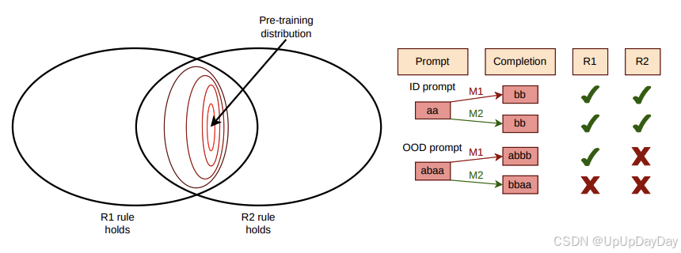
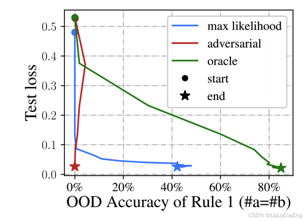
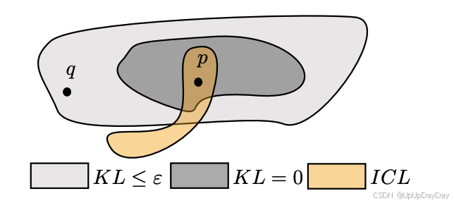

@[TOC](# 立场：理解大模型需要的不仅仅是统计概括)

# Position: Understanding LLMs Requires More Than Statistical Generalization

这是我们LLM reading club（一周一次或者两周一次）准备读的内容，我英文比较差，先读完然后再去聊，这周开始，我会尽可能准备好并上传到CSDN，如果正好有人也想读这些文章，那么大家正好一起看一下。我的特点是数学基础不够好，所以在门槛难度上，大家可以放心阅读。我会尽可能用简单的方法给大家分享的。我看不懂或者忘记的地方也会给一点原文没有的案例的，还有如果有说错的地方也可指导我一下，感谢。

当然文章现在阅读很简单，大家问大模型就可以了，我也使用了大模型来解释我不清楚的点，不过起码可以把这个内容当作中文翻译用一用。

这是一篇来自马普智能系统研究所，剑桥大学，UCL，ETH, etc. 的一篇文章主要是**理解大规模语言模型（LLMs）需要超越传统的统计泛化理论**的文章。链接是
[https://arxiv.org/pdf/2405.01964](https://arxiv.org/pdf/2405.01964)
## 背景
关于泛化能力的探讨：自回归的（Autoregressive (AR) language）（指的是通过next token prediction的结果进行下一次prediction，比如GPT，PaLM之类的模型）在内容理解和基于数据的fine tuning都表现的很好。过去有的研究说是因为interpolation regime（插值范式）。

*tips：插值范式指的是训练模型的状态，神经网络在训练集上训练误差会达到零或者接近零，即模型完全拟合训练数据。插值意思是模型学会了通过训练样本点，并将数据的所有模式完全捕获（我：这可能也导致了大家有一个理念：模型有更多参数，就可以去拟合任何任务）*

传统逻辑提出，大模型在大量样本上进行训练，并且基于训练，达到了很低的loss，因此它们在统计任务上有好的表现。但是“统计任务”这词本身无法统述整个下游任务。

尽管不同模型（M1 和 M2）在训练生成 $a^n$$b^n$  语言上实现了相同的最小测试损失，但在分布外（OOD）提示下，它们的行为可能不同，这种规则外推能力取决于transformer模型的归纳偏置能力，而非训练测试损失而获得。
## 核心观点

-	因此本文提出了我们应该从**饱和范式（saturation regime）**的角度去理解大模型：
   	- 在训练过程中，模型不仅在训练集上达到了全局最小损失，也在测试集上达到了最小测试损失。
   	- 即模型已经在目前分布内的数据已经在统计学上达到了最优损失。

- 	问题的提出：最优测试损失不足以解释模型表现
	- 即使在饱和范式下，不同的模型仍然会在分布外的测试数据上有较大差异
	- 这种情况说明：最低的测试损失不足以区分模型在复杂任务（比如out-of-distribution (OOD)的任务）上的表现差异。*（我：让我想到code generation，大家一开始都在用OpenAI的HumanEval，但是等到即便HumanEval的表现非常出色的时候，处理实际github任务的表现依然堪忧，当然现在已经不错了）*

可能的研究方向，模型的归纳偏置，任务的迁移能力，上下文学习能力。

这篇文章的**贡献**：

	- 强调了使用统计概括来理解研究达到饱和范式LLM的局限性
	- 用三个案例来证明上面说的局限性
	- 提出研究饱和范式下LLM的三种可能的方向

# 文章阅读
OK，来到文章部分。

## 第一部分是background。

关于**Statistical generalization（统计泛化）**，关键的知识点是，统计泛化是衡量模型是否能够转移到**相同分部**的未见测试数据上，这个与大家入门ML课程应该是一样的。这个概念本身很难解释现在DL的成功。除此以外，统计泛化的一个重要优点是其“黑箱性”，统计泛化不需要特定知识（比如pattern based 的方法的就是反例了，pattern写起来就很累嘛），适用范围广，只依赖于损失函数的定义，不需要考虑具体任务的定性。其他不是很重要，先跳过。

关于**Interpolation regime**,前面tips里面聊过了。

关于**Identifiability of Probabilistic Models**， 可识别性，是指统计模型是否可以从观测到的数据中唯一的恢复模型。举例，比如clustering的任务中，有白点和黑点分类，那白点和黑点的分组，分组本身是唯一的，因为他们的特征是清晰的，但是如果是一个像素点，他有灰度，那么它的分类可能是模糊的，那么就不具备可识别性了，当然任务简单，其实加入简单的pattern 比如灰度>half就是黑，就能解决，但是很多任务的评价维度其实很大，当定义损失函数也会很难（跑题了，当我没说😅）。

## 来到正文
AR（自回归） 模型的可识别性，自回归模型指

(对于固定的 $L ∈ N$) 的条件分布 ${p(xi |x1:i−1);L ≥ i ≥ 1}$ , 这些分布根据链式规则可以得出 ${p(x1:i);L ≥ i ≥ 1}$ 在整个sequence上.

即这个模型的每个元素的概率都依赖它之前的元素，并且基于链式规则，由条件逐步构建出完整序列的概率分布。

不可识别性：

- 功能不可识别性：基于上述的公式，我们可以发现，基于统计的AR models除非前面的prefixes是固定的，不然是无法从结果来判断功能是否是一致的。这是因为如果这些前缀如果未在数据上出现，那么模型在这些前缀上的行为可能因为不同的设计或者归因而无法从统计来确定唯一性（比如我目前项目中使用的中间态，如果忽略中间态的正确性，去判断最后结果的一致性，可能在跨数据集的任务上表现有差距，不过我还没试过）。

- ε−不可识别性 （Mac按一下fn键然后输入 eps）， 这是本文提出的新概念，ε是个阈值，表示模型在KL 散度（Kullback-Leibler divergence） 意义上的接近程度，如果模型$p$与模型$q$在KL散度小于ε，说明两个模型统计意义上非常相似。ε不可识别性之处，尽管接近，但是模型在统计意义上的接近可能在实际功能上会有显著的不同。即使存在唯一的全局最优点，模型的相似最优点之间仍然可能存在较大差异，以至于会影响实际的能力。

- 参数（parameters）不可识别性，这个比较容易理解了，不同的参数组合可以实现同一个离散分布的功能，也就是说，它们在零样本测试（zero-shot）任务中的表现可能是相同的。但由于这些模型的内部参数不同，它们在迁移学习（transfer learning）和微调（fine-tuning）过程中，可能表现出很大的差异。

### 例子1:非可识别性与规则外推（Rule Extrapolation）

给定一个自回归模型$q$让其拟合基于上下文无关语法（probabilistic context-free grammar，PCFG）$p$的句子生成任务，句子形式为$a^nb^n$,其中n是随机的。这种语法本身的支持是非常有限的比如abaa的出现概率就为0，这样的任务就是上文提到的OOD prompt。

**案例：**

如果出现 $KL [p(x{1:k})||q(x_{1:k})] = 0$那么我们可以说模型q在统计意义上完全拟合了任务分布$p$。即模型的分布与目标分布完全一致，模型在训练数据和测试数据上达到了最大似然估计（Maximum Likelihood Estimation, MLE）.
如果忘了看一下一个似然函数的公式。表示的是在给定参数的条件，观测到的数据的联合概率：
$$
L(\theta) = p(x_1, x_2, \dots, x_n \mid \theta) = \prod_{i=1}^n p(x_i \mid \theta)
$$
最大似然估计使用argmax，来找到参数$\theta$使得似然函数最大化：
$$
\hat{\theta} = \arg\max_{\theta}L(\theta)
$$
在这种情况下，模型达到了对观测数据的最佳模拟。

**回到本文的论述**， 可以发现即便$KL [p(x{1:k})||q(x_{1:k})] = 0$，当$p(x_{1:l})=0$，即在支持域之外时，模型的行为的定义是不明确的。这意味着任何property of 模型$q$在基于OOD prompts都是非唯一确定的（non-identificable）。
其中，规则外推（rule extrapolation）问题涉及两个规则：

- R1: $a$和$b$的数量必须匹配
- R2: b后面不能出现$a$

本文感兴趣的点是，模型是否在未显示表示规则的情况下，遵循规则R1.

#### 实例分析：
在这样的任务上，使用MLE的方法训练了基于解码器的Transformer模型，目标是生成$a^nb^n$的PCFG的sequence。上文提到的R1并未被显示要求。模型在OOD prompts（比如abaa） 的表现是评估的重点。
本文训练的transformer模型在长度为8的OOD提示上，可以以43.7%的准确率符合R1的序列。然后研究添加了两种附加模型，通过引入有监督损失对规则R1施加不同的影响：
 1. 对抗模型：使用了污染数据误导模型对R1对学习。
 2. Oracle模型，通过额外的监督数据显示加强模型对R1的学习。
 
结果： 尽管三种模型都在数据集上实现了**相同的最小测试损失**但是在规则外推的表现差距明显。这显示出模型即使没有明确的监督，仍然倾向于推断某些规律性。

### 例子2: ε不可识别性与情景学习（in-context learning (ICL)）

在实际的任务中，训练集中可能OOD prompt是一个非常小概率的情况，而不是完全不出现，目前有一个分布$q$，即模型学到的分布，p是训练数据的分布。而ICL是模型需要学习的规则，我们可以看到，有些规则可能是部分出现在$p$中的。

其中KL散度表示模型的$q$分布是否完全表示了$p$的情况，ε表示一个大于0的很小的差异。根据图片，$q$仍然能表示一些在$p$分布以外的ICL内容。

ICL的定义：模型能够基于提示中提供的input-output pair(e.g. ($x_i,y_i$)),在不更新参数的情况下直接从提示中学习任务并正确预测输入$x_{test}$的输出$y_{test}$

#### 研究设计
1. 目标分布$p$:
作者构造了一组HMM的混合生成，作为与训练分布，提示中的input-output pairs和测试输入都是同一个概念$\theta$下的HMM

2.  对比分布$q_n$:
	- 修改$p$的部分概率分布，仅仅在prompt structure相关的序列上进行调整。
	- 其他部分，$q_n$和$p$完全保持一致
	
3. 调整方法
 	- 针对提示完成的概率$(y \mid S_n, x_\text{test})$,将最高概率和次高概率的值稍做交换，以确保：
$$\arg\max_y q_n(y \mid S_n, x_\text{test}) \neq \arg\max_y p(y \mid S_n, x_\text{test}) $$
	
- 这种操作对KL散度的影响极小，调整后的KL始终满足<ε.
	
这样的调整证明了尽管保持KL散度在一个极小范围内变化，却可以摧毁ICL，也意味着，不同的模型或者分布即便在统计意义上接近，它们的ICL能力可能是完全不同的。

PS: 原文在附录里加入了很多数学论证，我跳过了，希望大家可以去看下证明逻辑有没有问题。
### 例子3: parameters的不可识别性

这次的实验，研究者将一个小型transformer嵌入到一个更大transformer中，并确保功能等价性。如果参数可感知，那么两者在预训练的损失完全相同的情况下，他们在OOD的下游任务上的表现应该相同。

然而，结果是在微调后，二者的表现有显著差异，大transformer能高出10%的下游任务准确率。

这表明模型的参数话和架构会显著影响微调和迁移学习的能力，这些能力可能和模型的归纳偏差的能力有关。

### 饱和阶段应该测量什么
既然loss和分布内的任务无法区分模型的正确率，那么什么是饱和阶段的研究方向，本文提出了三个。

#### 泛化测量
应该研究
1. 组合泛化：理解模型是否能够通过已知的组件组合推导出新知识。
2. 系统泛化：是否能在理解复杂任务中系统性推理。
3. 符号泛化：是否能处理形式语言（比如PCFG Probabilistic Context-Free Grammar）。

#### 可迁移性
目前的迁移测量指标不足以可靠评估微调后的性能
应该设计新的度量方式来评估微调和迁移能力。

#### 归纳偏置
应该研究哪些归纳偏置能够通过参数空间或者函数空间来诱导模型的特定属性。
归纳偏置可以帮助解释LLMs' OOD泛化和迁移的能力，超越仅靠着训练损失获得的性能。

### 讨论，未来的研究方向
- 更好的泛化测量指标
	- 需要开发更好的测量指标，比如组合泛化能力的测试，如通过理解'one', 'cat', 'black'，测试模型能否推导出'one cat', 'black cat'	的组合泛化能力
	- 拓广统计泛化的框架，将经典的Bayes泛化理论推广到更复杂的比如生成模型，元学习和处理相互关联的非i.i.d数据上去。
- 计算语言建模
	- 理解语言结构中的统计规律，以及这些规律如何影响模型的泛化和推理能力
- 归纳偏置的研究
	- 研究饱和阶段，不同参数表现出的不同的下游性能。
	- 选择合适的归纳偏置是否能捕获特定的下游任务属性，从而克服模型的不可识别性的限制。
	- 研究哪些归纳偏置可以引导模型有更好的OOD能力和迁移能力。

# 评价
一篇还可以的文章，但是主要是针对他对现有方法的批评，对未来的评价体系的归纳主要还是靠猜想，并没有提出新的方法，比如如何去推广到新的任务，或者用什么具体的归纳偏置的分析方式。不过本文提供了很多数学的证明，严谨性应该没问题，大家可以去看看。

# Update 讨论：
今天（1.14）有一个reading club的成员讨论，对于OOD的数据进行test，然后再比较，难到不也是使用统计概括吗。
Edoardo：本文可能值得只是in distribution部分的统计不足以概括一个LLM吧，比如同样两个英文-中文翻译器，都没有见过spanish，但是可能表现是不同的，可能一个可以在higher level对语言的structure有更好的理解，而另外一个是记住了pattern。

这次meeting，大家都去旅游了，大家都没提前读，没有什么其他有价值的，就读了读论文。
