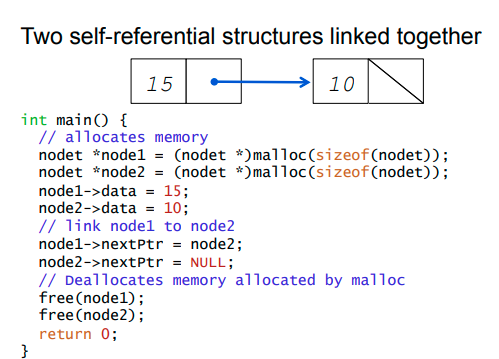

## Security Issues and Explanations

| English Name | Chinese Explanation | C | Java |
|--------------|---------------------|---|------|
| Null Pointer Exception (NPE) | 空指针异常 | ✅ | ✅ |
| Memory Leak | 内存泄漏 | ✅（频繁） | ✅（容易被忽视） |
| OutOfMemoryError (OOM) | 内存溢出 | ✅（可导致 crash） | ✅（抛异常） |
| StackOverflowError | 栈溢出 | ✅ | ✅ |
| Buffer Overflow | 缓冲区溢出 | ✅（致命） | ❌（数组越界抛异常） |
| Use-After-Free | 使用已释放内存 | ✅ | ❌（GC 管理） |
| Double Free | 重复释放内存 | ✅ | ❌ |
| Race Condition | 多线程竞争 | ✅ | ✅ |
| Deadlock | 死锁 | ✅ | ✅ |
| Dangling Pointer | 悬挂指针 | ✅ | ❌ |
| Denial of Service (DoS) | 拒绝服务 | ✅（资源耗尽） | ✅（如 OOM, 死循环） |
| Insecure Deserialization | 不安全反序列化 | ❌（较少用） | ✅（Java 原生有风险） |
| Sensitive Data Exposure | 敏感信息泄露 | ✅ | ✅ |
| Hardcoded Secrets | 硬编码密钥 | ✅ | ✅ |
| Path Traversal | 路径穿越攻击 | ✅ | ✅ |
| SQL Injection | SQL 注入 | ✅ | ✅（拼接 SQL） |
| XSS (Cross-Site Scripting) | 跨站脚本攻击 | ✅（Web场景） | ✅（Java Web中） |
| CSRF | 跨站请求伪造 | ✅（Web场景） | ✅（Spring 等 Web 框架） |
| Privilege Escalation | 权限提升 | ✅ | ✅ |
| Broken Access Control | 访问控制失败 | ✅ | ✅ |
| Remote Code Execution (RCE) | 远程代码执行 | ✅（比如系统调用） | ✅（如反序列化漏洞） |
| Directory Listing | 目录浏览漏洞 | ✅ | ✅ |

## Class 02


在C中: Fixd size data strucutre 有 single subscripted arrays, double subscripted arrays and structs

Dynamic data structures 比如 linked list, tree, graph, etc.

这一类被称为self referential structures,因为他们用一种类似指针的方式来引用自己。
而这种会被null pointer exception 或者out of memory 攻击。 





```c
#include <stdio.h>
#include <stdlib.h>

struct node {
    int data;
    struct node *next;
};

int main() {
    // allocates memory for three nodes
    struct node *node1 = (struct node *)malloc(sizeof(struct node));
    struct node *node2 = (struct node *)malloc(sizeof(struct node));
    struct node *node3 = (struct node *)malloc(sizeof(struct node));
    
    node1->data = 15;
    node2->data = 10;
    node3->data = 5;
    
    // link nodes
    node1->next = node2;
    node2->next = node3;
    node3->next = NULL;
    
    // Print the linked list
    printf("node1 data: %d\n", node1->data);
    printf("node2 data: %d\n", node1->next->data);
    printf("node3 data: %d\n", node1->next->next->data);
    

    printf("Accessing freed memory: %d\n", node1->data);     
    
    printf("Accessing freed memory of node3: %d\n", node1->next->next->data); // 可能会崩溃
    
    // Deallocates memory allocated by malloc
    free(node1);
    free(node2);
    free(node3);

    return 0;
}
```

### 可运行的 C 代码示例

<iframe width="100%" height="500px" src="https://godbolt.org/e#g:!((g:!((g:!((h:codeEditor,i:(filename:'1',fontScale:14,fontUsePx:'0',j:1,lang:c,selection:(endColumn:1,endLineNumber:1,positionColumn:1,positionLineNumber:1,selectionStartColumn:1,selectionStartLineNumber:1,startColumn:1,startLineNumber:1),source:''),l:'5',n:'0',o:'C+source+%231',t:'0')),k:50,l:'4',n:'0',o:'',s:0,t:'0'),(g:!((h:executor,i:(argsPanelShown:'1',compilationPanelShown:'0',compiler:cg132,compilerName:'',compilerOutShown:'0',execArgs:'',execStdin:'',fontScale:14,fontUsePx:'0',j:1,lang:c,libs:!(),options:'',source:1,stdinPanelShown:'1',tree:'1',wrap:'1'),l:'5',n:'0',o:'Executor+x86-64+gcc+13.2+(C,+Editor+%231)',t:'0')),k:50,l:'4',n:'0',o:'',s:0,t:'0')),l:'2',n:'0',o:'',t:'0')),version:4"></iframe>


在这个示例中，我们有三个节点：node1、node2 和 node3。假设 node1 的 next 是 node2 的地址，而 node2 的地址被释放了，那么 node1 的 next 就变成了一个无效的地址。

比如这种，假设 node1 的 next 目前是 node2 的地址，但是 node2 的地址被释放了，那么 node1 的 next 就变成了一个无效的地址。如果这个链不止在这停止，那么后续整个链表都会变成无效的地址。

```c
#include <stdio.h>
#include <stdlib.h>

struct node {
    int data;
    struct node *next;
};

int main() {
    // allocates memory for three nodes
    struct node *node1 = (struct node *)malloc(sizeof(struct node));
    struct node *node2 = (struct node *)malloc(sizeof(struct node));
    struct node *node3 = (struct node *)malloc(sizeof(struct node));
    
    node1->data = 15;
    node2->data = 10;
    node3->data = 5;
    
    // link nodes
    node1->next = node2;
    node2->next = node3;
    node3->next = NULL;
    
    // Print the linked list
    printf("node1 data: %d\n", node1->data);
    printf("node2 data: %d\n", node1->next->data);
    printf("node3 data: %d\n", node1->next->next->data);
    
    // Deallocates memory allocated by malloc

    free(node2);
    
    // Attempt to access freed memory (Dangling Pointer)
    // 这将导致未定义行为，可能会崩溃或输出垃圾值
    printf("Accessing freed memory: %d\n", node1->data); // 可能会崩溃或输出垃圾值
    
    // 进一步演示攻击造成的崩溃
    printf("Accessing freed memory of node3: %d\n", node1->next->next->data); // 可能会崩溃
    
    return 0;
}
```

```c
Program terminated with signal: SIGSEGV
```

说明了，如果一个指针指向的内存被释放了，那么这个指针就会变成一个悬挂指针，如果继续使用这个指针，就会导致未定义行为，可能会崩溃或输出垃圾值。

这样的错误应该在java中被避免。因为java有垃圾回收机制，将值设置为null,并不会造成ptr被释放。

以下是java的代码示例：

```java
class Node {
    int data;
    Node next;

    Node(int data) {
        this.data = data;
        this.next = null;
    }
}

class LinkedList {
    public static void main(String[] args) {
        // allocates memory for three nodes
        Node node1 = new Node(15);
        Node node2 = new Node(10);
        Node node3 = new Node(5);
        
        // link nodes
        node1.next = node2;
        node2.next = node3;
        node2 = null; // 释放 node2，node1.next 现在指向 null
        
        // Print the linked list
        System.out.println("node1 data: " + node1.data);
        System.out.println("node2 data: " + node1.next.data); 
        System.out.println("node2 data: " + node2);
        System.out.println("node3 data: " + node1.next.next.data); 
    }
}

```
```java
node1 data: 15
node2 data: 10
node2 data: null
node3 data: 5
```
